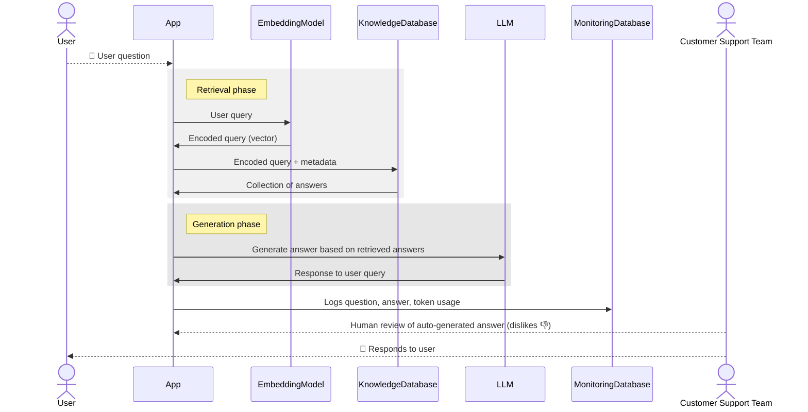
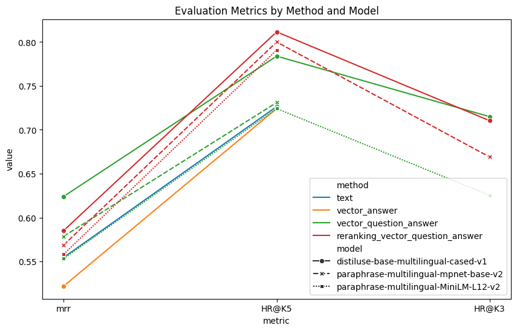
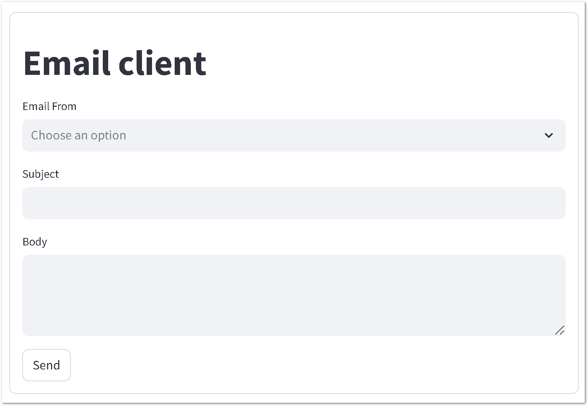
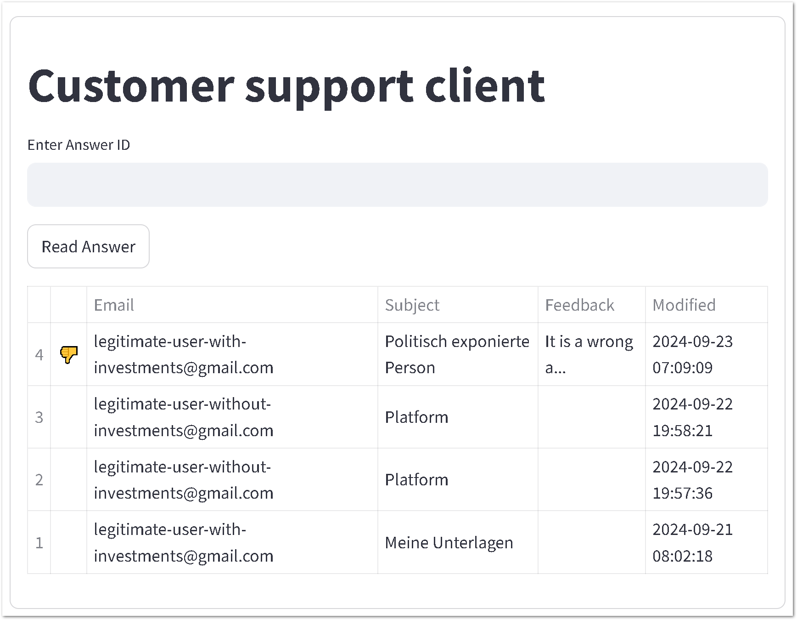
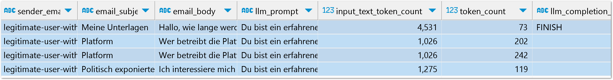
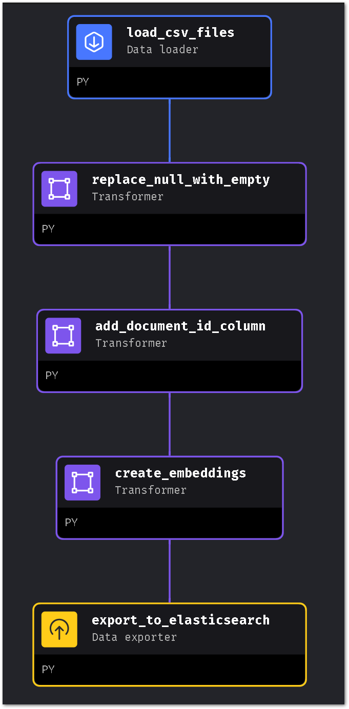
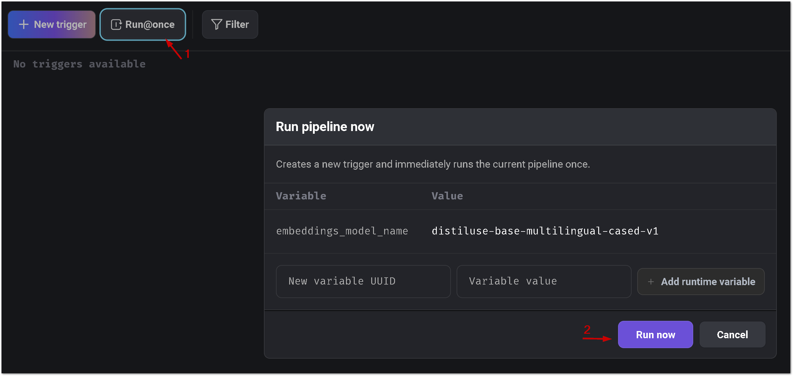
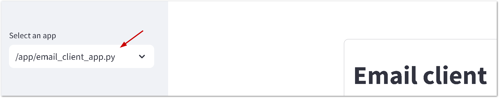
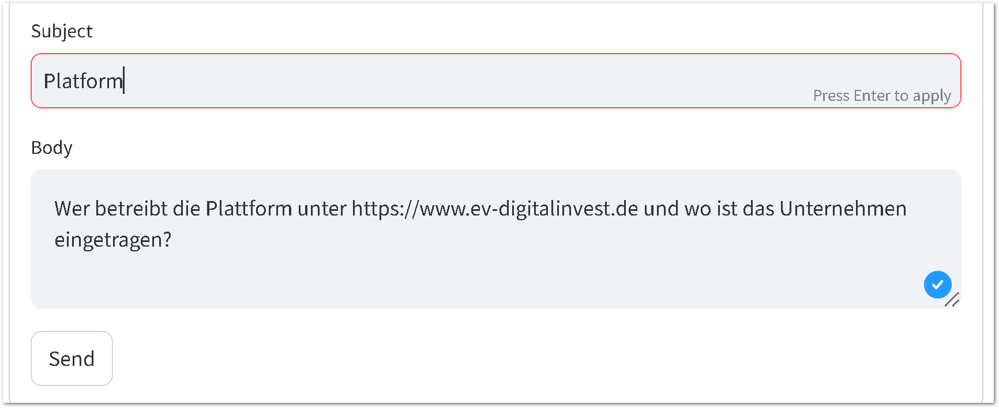
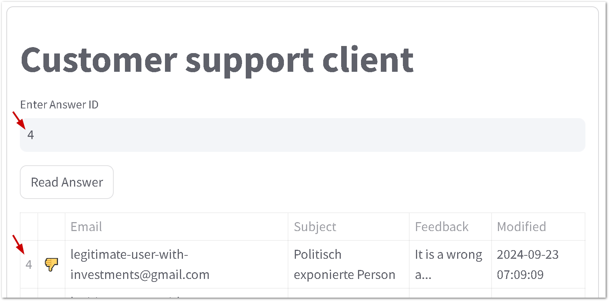

- [Project Description](#project-description)
- [The Dataset](#the-dataset)
- [Solution Components](#solution-components)
  - [RAG Flow](#rag-flow)
  - [Retrieval Evaluation](#retrieval-evaluation)
  - [RAG Evaluation](#rag-evaluation)
  - [Interface](#interface)
  - [Monitoring](#monitoring)
  - [Containerization](#containerization)
  - [Document Re-ranking](#document-re-ranking)
  - [Ingestion Pipeline](#ingestion-pipeline)
- [How to Start the Solution Locally](#how-to-start-the-solution-locally)
  - [Run Components as Docker Containers](#run-components-as-docker-containers)
  - [Start the Pipeline](#start-the-pipeline)
  - [Test the UI](#test-the-ui)
    - [Open UI Applications](#open-ui-applications)
    - [Input Questions](#input-questions)
      - [Question Examples](#question-examples)
    - [Review the Answers](#review-the-answers)
  - [Clean Up](#clean-up)

# Project Description
The goal of this solution is to explore the concept of a system that can efficiently respond to customer emails, providing personalized and human-like replies. The system is designed to ensure that customers feel they are interacting with real people.

# The Dataset
The dataset is generated using publicly available content from my employer's website as of September 2024. The following pages were used to create the dataset:

- https://www.ev-digitalinvest.de/anleger/faq
- https://www.ev-digitalinvest.de/analyseprozess
- https://www.ev-digitalinvest.de/anleger
- https://www.ev-digitalinvest.de/agb

The content from these pages was converted into a set of FAQ-style questions and answers, which are stored in the [FAQs](mage/data/faqs) folder.

# Solution Components

## RAG Flow
The Retrieval-Augmented Generation (RAG) flow consists of two components: `retrieval` and `generation`, as shown in the diagram below.



- Components:
  - The `retrieval` service is implemented in [retrieval_service.py](smart_mail/src/services/retrieval_service.py)
  - The `generation` service is handled by [generation_service.py](smart_mail/src/services/generation_service.py)

## Retrieval Evaluation
- A ground truth dataset was generated using the notebook [02_create_ground_truth.ipynb](notebook/retrieval_evaluation/02_create_ground_truth.ipynb), containing five questions per Q&A pair from the original dataset.
- Retrieval evaluation was performed using the following notebooks:
  - [03_evaluate_text_retrieval.ipynb](notebook/retrieval_evaluation/03_evaluate_text_retrieval.ipynb)
  - [04_vector_question_answer_retrieval.ipynb](notebook/retrieval_evaluation/04_vector_question_answer_retrieval.ipynb)
  - [05_evaluate_reranking.ipynb](notebook/retrieval_evaluation/05_evaluate_reranking.ipynb)
  - [06_vector_answer_retrieval.ipynb](notebook/retrieval_evaluation/06_vector_answer_retrieval.ipynb)

- The evaluation metrics used are:
  - **Mean Reciprocal Rank (MRR)**: Measures how well the system ranks the correct answer. A higher MRR indicates better performance.
  - **Recall@k**: Measures how many relevant documents are retrieved in the top k results. Higher Recall@k means better performance.

- Three models and four retrieval methods were tested, with results visualized in [20_analytics.ipynb](notebook/retrieval_evaluation/20_analytics.ipynb). The evaluation results indicated that `distiluse-base-multilingual-cased-v1` performed the best and should be used for creating embeddings for the Q&A pairs.



## RAG Evaluation
The RAG evaluation has not been conducted yet.

## Interface
Two applications have been developed to verify the concept:
  - **Email Client**: Simulates sending emails to the system.
  - **Customer Support Client**: Allows the support team to review generated responses.

Below are sample interfaces:



## Monitoring
The system logs key metrics into a PostgreSQL database, including:
  - **Number of input and output tokens**: Tracks token usage for both the input prompt and the generated response.
  - **LLM Processing Time**: Measures the time taken by the LLM to generate a response.
  - **Total Processing Time**: Includes the LLM processing time and any additional processing overhead.
  - **Processing Status**: Tracks if a request is pending, processed, or encountered an error.

These metrics help monitor the system's performance and detect any processing issues.



## Containerization
The entire solution is containerized. Refer to [Run Components as Docker Containers](#run-components-as-docker-containers) for instructions on how to start the system locally.

## Document Re-ranking
The solution implements document re-ranking, combining rankings from multiple retrieval systems into a final ranking. The implementation can be found in [reciprocal_rank_fusion_service.py](smart_mail/src/services/reciprocal_rank_fusion_service.py).

Tests for the re-ranking service are located in the [reciprocal_rank_fusion_service_test.py](smart_mail\tests\services\reciprocal_rank_fusion_service_test.py) file.

## Ingestion Pipeline
- The ingestion pipeline is powered by [Mage.AI](https://mage.ai). Below is the high-level overview of the process:

  ```mermaid
  sequenceDiagram
      actor CustomerSupportTeam as Customer Support Team
      note right of CustomerSupportTeam: Building a knowledge base
      CustomerSupportTeam-->>FileStorage: Prepare Q&A list
      participant IngestionPipeline as Ingestion Pipeline (Mage.ai)
      IngestionPipeline->>FileStorage: Retrieve Q&A list
      FileStorage->>IngestionPipeline: CSV (or PDF) files
      IngestionPipeline->>EmbeddingModel: Generate embeddings
      EmbeddingModel->>IngestionPipeline: Embeddings (vectors)
      IngestionPipeline->>KnowledgeDatabase: Index embeddings
  ```

- The pipeline files are located in the [mage/zoomcamp-smart-mail/smart-mail](mage/zoomcamp-smart-mail/smart-mail) folder.

- The overview of the pipeline steps represented in the picture below:
  

# How to Start the Solution Locally
Local execution is the simplest way to test the solution components. It uses a local LLM model and does not require access to AWS services. However, note that the local LLM shows average performance for generating German responses.

## Run Components as Docker Containers
To start the solution, run the following command (it may take 30-40 minutes or more):

```bash
docker compose -f docker-compose.yml -f docker-compose.test.yml -p smart-mail up --build
```

Wait for the solution to initialize. Logs will be displayed in the terminal.

## Start the Pipeline
No additional setup is required. To run the ingestion pipeline, open the browser and navigate to:

http://localhost:6789/pipelines/ingestion_evdi/triggers

Click the `Run@once` button. The pipeline will take 5-10 minutes to complete.



## Test the UI
### Open UI Applications
To open the Email Client, visit http://localhost:8501/ and select the `email_client.py` option from the sidebar.



Please note that the first start can take time to download the sentence-transformers model.

### Input Questions
Test the system by entering questions from the [Question Examples](#question-examples) section.



#### Question Examples
1. Wie kann ich das Risiko einer Investition in Immobilien einschätzen?
1. Wer ist für die finale Projekteinschätzung verantwortlich?
1. Wie lange dauert es, bis ich mein Geld zurückbekommen kann, wenn ich es brauche?
1. Welche Schritte muss ich unternehmen, um mein Geld zügig zurückzuerhalten, falls notwendig?
### Review the Answers
To review answers, open http://localhost:8501/ and select `customer_support_client.py` from the sidebar. Input the Answer ID and click `Read Answer`.



## Clean Up
After testing, clean up the Docker containers by running:

```bash
docker compose -p smart-mail down
```
