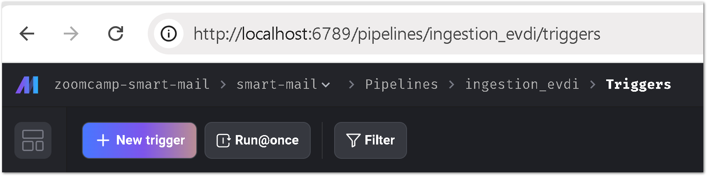
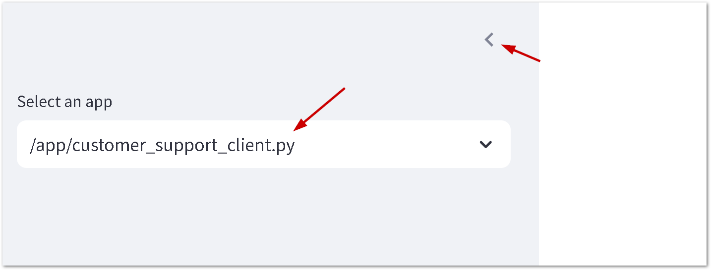

- [Project description](#project-description)
- [The dataset](#the-dataset)
- [Solution components](#solution-components)
  - [RAG flow](#rag-flow)
  - [Retrieval evaluation](#retrieval-evaluation)
  - [RAG evaluation](#rag-evaluation)
  - [Interface](#interface)
  - [Monitoring](#monitoring)
  - [Containerization](#containerization)
  - [Document re-ranking](#document-re-ranking)
  - [Ingestion pipeline](#ingestion-pipeline)
- [How to start solution locally](#how-to-start-solution-locally)
  - [Start solution components as Docker containers](#start-solution-components-as-docker-containers)
  - [Start the pipeline](#start-the-pipeline)
  - [Test UI](#test-ui)
    - [Open UI applications](#open-ui-applications)
    - [Enter questions](#enter-questions)
      - [AGB related questions](#agb-related-questions)
      - [Miscellaneous questions:](#miscellaneous-questions)
    - [Review the answers](#review-the-answers)
  - [Clean up](#clean-up)


# Project description
The goal of this solution is to test the concept of a system that can efficiently respond to customer emails. Additionally, the system is designed to craft personalized replies, ensuring that customers feel they are interacting with real people.

# The dataset
The dataset is created based on publicly available data from my employer's website, where I work as of September 2024.

The following pages have been used to prepare the dataset:
- https://www.ev-digitalinvest.de/anleger/faq
- https://www.ev-digitalinvest.de/analyseprozess
- https://www.ev-digitalinvest.de/anleger
- https://www.ev-digitalinvest.de/analyseprozess
- https://www.ev-digitalinvest.de/agb

The pages are converted into a set of FAQ questions and answers and are stored in the [FAQs](mage/data/faqs) folder.

# Solution components
## RAG flow
- The RAG flow contains of the `retrieval` and `generation` components. Both of them are highlighted on the diagram below.
    ```mermaid
    sequenceDiagram
        actor User
        User-->>App: 📧 User question
        rect rgb(240, 240, 240)
        note right of App: Retrieval phase
        App->>EmbeddingModel: User query
        EmbeddingModel->>App: User encoded query (vector)
        App->>KnowledgeDatabase: User encoded query with user metadata
        KnowledgeDatabase->>App: A collection of answers
        end
        rect rgb(230, 230, 230)
        note right of App: Generation phase
        App->>LLM: Request to create answer based on the collection of answers
        LLM->>App: An answer to the user question
        end
        App->>MonitoringDatabase: The user question, answer, number of tokens is used
        actor CustomerSupportTeam as Customer Support Team

        CustomerSupportTeam-->>App: Review auto-generated response with human evaluation (dislikes 👎)
        CustomerSupportTeam-->>User: 📧 The answer to the question
    ```
- The files:
    - The `retrieval` component is represented by the [retrieval_service.py](smart_mail/src/services/retrieval_service.py)
    - The `generation` one is implemented in the [generation_service.py](smart_mail/src/services/generation_service.py)

## Retrieval evaluation
- To evaluate the [dataset](#the-dataset), ground truth dataset was generated using the notebook [02_create_ground_truth](notebook/retrieval_evaluation/02_create_ground_truth.ipynb). It includes five questions per question/answer pair from the dataset.
- The retrieval evaluation is performed using followin notebooks:
    - [03_evaluate_text_retrieval.ipynb](notebook/retrieval_evaluation/03_evaluate_text_retrieval.ipynb)
    - [04_vector_question_answer_retrieval.ipynb](notebook/retrieval_evaluation/04_vector_question_answer_retrieval.ipynb)
    - [05_evaluate_reranking.ipynb](notebook/retrieval_evaluation/05_evaluate_reranking.ipynb)
    - [06_vector_answer_retrieval.ipynb](notebook/retrieval_evaluation/06_vector_answer_retrieval.ipynb)

- The following metrics have been used to evaluate the retrieval performance:
    - Mean Reciprocal Rank (MRR): This metric measures how well the system ranks the correct answer. It calculates the reciprocal of the rank at which the first relevant document is retrieved. A higher MRR indicates better performance, with the system ranking relevant answers closer to the top.
    - Recall at k: This metric measures the proportion of relevant documents retrieved in the top k results. For example, Recall@5 indicates how many of the relevant documents are found in the top 5 retrieved results. A higher Recall@k suggests that the system is effectively retrieving relevant information within the top k results.
- Four models and four methods have been tested. The graphical representation is done using the file  [20_analytics.ipynb](notebook/retrieval_evaluation/20_analytics.ipynb).
- The output of the evaluation is shown below:
    

- Based on the results, the model `distiluse-base-multilingual-cased-v1` should be used to create embeddings for the question/answer pairs to perform the most effective retrieval. This model consistently showed the highest MRR and Recall@k scores across different retrieval methods.

## RAG evaluation
The RAG evaluation has not been performed yet.

## Interface
- To verify the concept, two applications have been created:
    - Email client
    - Customer support client
- The email client simulates sending emails to the system, while the customer support client application allows the customer support team to review the generated answers.
- The interface of the email client is shown below:


- To review the personalized answer, the customer support team can use another UI to access the list of answers to review them:


## Monitoring
- The solution includes logging to PostgreSQL and preserves the following metrics:

  - **Number of input and output tokens**:
    - `input_text_token_count`: The count of tokens in the prompt sent to the LLM. Used for monitoring input complexity and LLM costs.
    - `token_count`: The count of tokens in the response generated by the LLM.

  - **LLM processing time**:
    - `llm_response_time_ms`: Time taken (in milliseconds) by the LLM to generate the response. Useful for performance tracking.

  - **Total processing time**:
    - `total_processing_time_ms`: The total time spent processing the record, including the LLM response time.

  - **Processing status**:
    - `processing_status`: Tracks the status of the processing, e.g., 'pending', 'processed', or 'error'.

- These metrics are essential for monitoring the performance and efficiency of the system, as well as for identifying and troubleshooting any issues that may arise during the processing of customer emails.
- A general overview of the data table is shown in the picture below.
  

## Containerization
The solution is fully containerized. To get mode details on how to start all components, please refer to the section [Start solution components as Docker containers](#start-solution-components-as-docker-containers).

##  Document re-ranking
The solution implements re-ranking that combines the rankings of multiple search engines or recommendation systems into a single ranking. See the implementation in the file [reciprocal_rank_fusion_service.py](smart_mail/src/services/reciprocal_rank_fusion_service.py).


## Ingestion pipeline
- The ingestion pipeline is powered by [Mage.AI](https://mage.ai). The high-level diagram of the ingestion process is depicted below.

    ```mermaid
    sequenceDiagram
        actor CustomerSupportTeam as Customer Support Team
        note right of CustomerSupportTeam: Building a knowledge base
        CustomerSupportTeam-->>FileStorage: Prepare a list of questions and answers to them
        participant IngestionPipeline as Ingestion Pipeline (Mage.ai)
        IngestionPipeline->>FileStorage: Get a list of questions
        FileStorage->>IngestionPipeline: CSV (or PDF) files
        IngestionPipeline->>EmbeddingModel: Create embeddings
        EmbeddingModel->>IngestionPipeline: Embeddings (vectors)
        IngestionPipeline->>KnowledgeDatabase: Index embeddings
    ```
- All pipeline files are placed in the [mage/zoomcamp-smart-mail/smart-mail](mage/zoomcamp-smart-mail/smart-mail) folder.

# How to start solution locally
All components, including LLM, can be run locally without additional configuration to test the solution.

> Please note that the local deployment uses OLLAMA LLM (Local Language Model :-), which shows mediocre results in generating German responses.

## Start solution components as Docker containers
- To start the solution, run the following command. Please be informed that the operation can take 30 minutes or even more to get everything running.
    ```bash
    docker compose -f docker-compose.yml -f docker-compose.test.yml -p smart-mail up --build
    ```

- Wait for the solution to start. The logs will be displayed in the terminal.

## Start the pipeline
- All components are preinstalled in the Docker container. You do not need to install anything.
- Open the browser and go to the page http://localhost:6789/pipelines/ingestion_evdi/triggers

- Click on the `Run@once` button to start the pipeline with default settings.

- Wait for 5-10 minutes for the pipeline to finish. The pipeline status should be `completed`.

## Test UI
### Open UI applications
- To open the email client, go to the page http://localhost:8501/ and chose the `email_client.py` option on the left side bar.


    > Please note that the first start can take time to download the sentence-transformers model.

### Enter questions
- To test, input any question from lists below to the Email client. In the picture below, you can see an example question from the list of AGB-related questions.

- Be patient and wait for the green message indicating that the answer has been processed. It can take 3-5 minutes or even more because the solution uses local resources to process the answer. During the processing, the message " Processing..." will be displayed on the top right corner of the screen.

#### AGB related questions
The AGB questions are the following:
1. Welche Rolle spielt EV Digital Invest AG bei der Vermittlung von Verträgen und welche Leistungen erbringt das Unternehmen nicht?
1. Wie lange werden die Vertragsunterlagen im Postfach des Nutzers gespeichert?
1. Unter welchen Umständen kann die Verfügbarkeit der Plattform eingeschränkt sein?
1. Wie kann das Nutzungsverhältnis gekündigt werden und welche Auswirkungen hat dies auf bestehende Verträge?
1. Welches Recht gilt für die Nutzungsbedingungen und wo ist der Gerichtsstand für Streitigkeiten?
#### Miscellaneous questions:
1. Wer ist für die finale Projekteinschätzung verantwortlich?
1. Ich interessiere mich für Politik und meine Nachbarn fragen mich oft nach meiner Meinung zu diesem oder jenem politischen Thema. Bin ich eine politisch exponierte Person (PEP)?
1. Kann ich ohne Risiko in Ihre Projekte investieren?
1. Wie lange dauert es, bis ich mein Geld zurückbekommen kann, wenn ich es brauche?
1. Gibt es eine Möglichkeit, schnell an mein investiertes Geld zu kommen?
1. Welche Schritte muss ich unternehmen, um mein Geld zügig zurückzuerhalten, falls notwendig?
### Review the answers
- To review the answers, open the page http://localhost:8501/ and chose the `customer_support_client.py` option on the left side bar:

- Review the answers by providing an Answer Id from the table and clicking the `Read Answer` button.

- Test the application by providing a feedback on the quality of the generated answer.
- Reload the page and check the review. The review should be displayed in the table.

## Clean up
After you finish your review, clean up the solution's containers by running the following command:
    ```bash
    docker compose -p smart-mail down
    ```