- [Project Description](#project-description)
- [The Dataset](#the-dataset)
- [Structure of the Repository](#structure-of-the-repository)
  - [Overview of the Repository Structure](#overview-of-the-repository-structure)
  - [Detailed Description of the Repository Structure](#detailed-description-of-the-repository-structure)
- [Solution Components](#solution-components)
  - [Interface](#interface)
  - [RAG Flow](#rag-flow)
  - [Retrieval Evaluation](#retrieval-evaluation)
  - [RAG Evaluation](#rag-evaluation)
  - [Monitoring](#monitoring)
  - [Containerization](#containerization)
  - [Document Re-ranking](#document-re-ranking)
  - [Ingestion Pipeline](#ingestion-pipeline)
- [How to Start the Solution](#how-to-start-the-solution)
  - [Execution with local LLM](#execution-with-local-llm)
    - [Run Components as Docker Containers](#run-components-as-docker-containers)
    - [Start the Pipeline](#start-the-pipeline)
    - [Test the UI](#test-the-ui)
      - [Open UI Applications](#open-ui-applications)
      - [Input Questions](#input-questions)
        - [Question Examples](#question-examples)
      - [Review the Answers](#review-the-answers)
    - [Clean Up](#clean-up)
  - [Execution with online LLM](#execution-with-online-llm)
    - [Setup AWS Environment](#setup-aws-environment)
    - [Start Dependencies](#start-dependencies)
    - [Install Python packages](#install-python-packages)
    - [Start the Solution](#start-the-solution)
    - [Clean Up](#clean-up-1)

# Project Description
The goal of this solution is to explore the concept of a system that can efficiently respond to customer emails, providing personalized and human-like replies. The system is designed to ensure that customers feel they are interacting with real people.

# The Dataset
The dataset is generated using publicly available content in German from my employer's website as of September 2024. The following pages were used to create the dataset:

- https://www.ev-digitalinvest.de/anleger/faq
- https://www.ev-digitalinvest.de/analyseprozess
- https://www.ev-digitalinvest.de/anleger
- https://www.ev-digitalinvest.de/agb

The content from these pages was converted into a set of FAQ-style questions and answers, which are stored in the [FAQs](mage/data/faqs) folder.

# Structure of the Repository
## Overview of the Repository Structure

The `llm-zoomcamp-smart-mail` project is organized as follows:

```
llm-zoomcamp-smart-mail/
├─ .devcontainer/
│  └─ (development container configurations)
├─ images/
│  └─ (documentation images)
├─ mage/
│  ├─ data/
│  │  └─ (pipeline dataset)
│  └─ zoomcamp-smart-mail/
│     └─ (pipeline files)
├─ notebook/
│  └─ (Jupyter notebooks for evaluation)
├─ smart_mail/
│  ├─ src/
│  │  ├─ streamlit_runner.py
│  │  ├─ email_client.py
│  │  └─ customer_support_client.py
│  └─ tests/
│     └─ (tests for the solution)
├─ .gitignore
├─ requirements.txt
└─ README.md
```

## Detailed Description of the Repository Structure
1. **.devcontainer/**
   - Purpose: Provides [development container](https://code.visualstudio.com/docs/devcontainers/containers) configuration.
   - Usage: Optional. Ensures consistent development environment across different machines.

1. **images/**
   - Purpose: Stores documentation images.
   - Contents: Image files used in project documentation.

1. **mage/**
   - Purpose: Contains Mage.AI pipeline files for data processing.
   - Subfolders:
     - `data/`: Stores the dataset used by the Mage.AI pipeline.
     - `zoomcamp-smart-mail/`: Contains specific pipeline files for smart mail processing.

1. **notebook/**
   - Purpose: Houses Jupyter notebooks for evaluation and analysis.
   - Contents: `.ipynb` files used for data exploration, model evaluation, and result visualization.

1. **smart_mail/**
   - Purpose: Core application directory containing source code and tests.
   - Subfolders:
     - `src/`: Source code for the main application:
       - `streamlit_runner.py`: Launches Streamlit UI applications. See [Interface](#interface) section for details.
       - `email_client.py`: Implements the Email Client application (composition root).
       - `customer_support_client.py`: Implements the Customer Support Client application (composition root).
     - `tests/`: Contains unit tests for the service `reciprocal_rank_fusion_service.py`.

# Solution Components
## Interface
Two applications have been developed to verify the concept:
  - **Email Client**: Simulates sending emails to the system.
  - **Customer Support Client**: Allows the support team to review generated responses.

Below are sample interfaces:


## RAG Flow
The Retrieval-Augmented Generation (RAG) flow consists of two components: `retrieval` and `generation`, as shown in the diagram below.

```mermaid
sequenceDiagram
    actor User as User
    User-->>App: 📧 User question (using Email Client App)
    rect rgb(240, 240, 240)
    note right of App: Retrieval phase
    App->>EmbeddingModel: User query
    EmbeddingModel->>App: Encoded query (vector)
    App->>KnowledgeDatabase: Encoded query + metadata
    KnowledgeDatabase->>App: Collection of answers
    end
    rect rgb(230, 230, 230)
    note right of App: Generation phase
    App->>LLM: Generate answer based on retrieved answers
    LLM->>App: Response to user query
    end
    App->>MonitoringDatabase: Logs question, answer, token usage
    actor CustomerSupportTeam as Customer Support Team

    CustomerSupportTeam-->>App: Human review of auto-generated answer (dislikes 👎)
    CustomerSupportTeam-->>User: 📧 Responds to user (copy-paste from the system to Outlook)
```



- Components:
  - The `retrieval` service is implemented in [retrieval_service.py](smart_mail/src/services/retrieval_service.py)
  - The `generation` service is represented by two services:
    - For the local (offline) execution the service [ollama_generation_service.py](smart_mail/src/services/generation/ollama_generation_service.py) is used.
    - For the online execution the service [aws_generation_service.py](smart_mail/src/services/generation/aws_generation_service.py) is used.

## Retrieval Evaluation
- A ground truth dataset was generated using the notebook [02_create_ground_truth.ipynb](notebook/retrieval_evaluation/02_create_ground_truth.ipynb), containing five questions per Q&A pair from the original dataset.

- Four retrieval methods were tested with three different models:
  - text retrieval
  - vector retrieval for the pair of fields question/answer
  - re-ranking against a set of vector-question-answer-retrieval and text retrieval
  - vector retrieval for the answer field

- Retrieval evaluation was performed using the following notebooks accordingly:
  - [03_evaluate_text_retrieval.ipynb](notebook/retrieval_evaluation/03_evaluate_text_retrieval.ipynb)
  - [04_vector_question_answer_retrieval.ipynb](notebook/retrieval_evaluation/04_vector_question_answer_retrieval.ipynb)
  - [05_evaluate_reranking.ipynb](notebook/retrieval_evaluation/05_evaluate_reranking.ipynb)
  - [06_vector_answer_retrieval.ipynb](notebook/retrieval_evaluation/06_vector_answer_retrieval.ipynb)

- The evaluation metrics used are:
  - **Mean Reciprocal Rank (MRR)**: Measures how well the system ranks the correct answer. A higher MRR indicates better performance.
  - **Recall@k**: Measures how many relevant documents are retrieved in the top k results. Higher Recall@k means better performance.

- Data visualization was performed in the notebook [20_analytics.ipynb](notebook/retrieval_evaluation/20_analytics.ipynb).

- The evaluation results are represented in the picture below:

- Conclusion:
  - The embedding model `distiluse-base-multilingual-cased-v1` performed the best results for the given dataset in German.
  - Re-ranking with top 5 retrieval results should be used.

## RAG Evaluation
The RAG evaluation has not been conducted yet.

## Monitoring
The system logs key metrics into a PostgreSQL database, including:
  - **Number of input and output tokens**: Tracks token usage for both the input prompt and the generated response.
  - **LLM Processing Time**: Measures the time taken by the LLM to generate a response.
  - **Total Processing Time**: Includes the LLM processing time and any additional processing overhead.
  - **Processing Status**: Tracks if a request is pending, processed, or encountered an error.

These metrics help monitor the system's performance and detect any processing issues.


## Containerization
The entire solution is containerized. Refer to [Run Components as Docker Containers](#run-components-as-docker-containers) for instructions on how to start the system locally.

## Document Re-ranking
The solution implements document re-ranking, combining rankings from multiple retrieval systems into a final ranking. The implementation can be found in [reciprocal_rank_fusion_service.py](smart_mail/src/services/reciprocal_rank_fusion_service.py).

Tests for the re-ranking service are located in the [reciprocal_rank_fusion_service_test.py](smart_mail/tests/services/reciprocal_rank_fusion_service_test.py) file.

## Ingestion Pipeline
- The ingestion pipeline is powered by [Mage.AI](https://mage.ai). Below is the high-level overview of the process:

  ```mermaid
  sequenceDiagram
      actor CustomerSupportTeam as Customer Support Team
      note right of CustomerSupportTeam: Building a knowledge base
      CustomerSupportTeam-->>FileStorage: Prepare Q&A list
      participant IngestionPipeline as Ingestion Pipeline (Mage.ai)
      IngestionPipeline->>FileStorage: Retrieve Q&A list
      FileStorage->>IngestionPipeline: CSV (or PDF) files
      IngestionPipeline->>EmbeddingModel: Generate embeddings
      EmbeddingModel->>IngestionPipeline: Embeddings (vectors)
      IngestionPipeline->>KnowledgeDatabase: Index embeddings
  ```

- The pipeline files are located in the [mage/zoomcamp-smart-mail/smart-mail](mage/zoomcamp-smart-mail/smart-mail) folder.

- The overview of the pipeline steps represented in the picture below:


# How to Start the Solution
The solution can be launched in two ways:
1. **Execution with local LLM**: The simplest way to test the solution components. It uses a local OLLAMA model and does not require access to external services and API keys. Please note, the local LLM shows average or even _poor_ performance and quality for generating German responses. To achieve better results, use the next option.

1. **Execution with online LLM**: The recommended way to test the solution. It uses the AWS LLM service and requires an AWS account and API keys.

## Execution with local LLM
The approach uses a local LLM model and does not require access to external services and API keys. No any extra setup is required. Everything is included in the repository.

### Run Components as Docker Containers
To start the solution, run the following command. It may take 30-40 minutes or more to download the required Docker images and initialize the system:

```bash
docker compose -f docker-compose.yml -f docker-compose.test.yml -p smart-mail up --build
```

Wait for the solution to initialize. Logs will be displayed in the terminal.

### Start the Pipeline
To run the pre-configured ingestion pipeline, open the browser and navigate to:

http://localhost:6789/pipelines/ingestion_evdi/triggers

Click the `Run@once` button. The pipeline will take 5-10 minutes to complete.


### Test the UI
#### Open UI Applications
To open the Email Client, visit http://localhost:8501/ and select the `email_client.py` option from the sidebar.


Please note that the first start can take time to download the sentence-transformers model. It will be improved in the future.

#### Input Questions
Test the system by entering questions from the [Question Examples](#question-examples) section below.


##### Question Examples
1. Wie kann ich das Risiko einer Investition in Immobilien einschätzen?
1. Wer ist für die finale Projekteinschätzung verantwortlich?
1. Wie lange dauert es, bis ich mein Geld zurückbekommen kann, wenn ich es brauche?
1. Welche Schritte muss ich unternehmen, um mein Geld zügig zurückzuerhalten, falls notwendig?
#### Review the Answers
To review answers, open http://localhost:8501/ and select `customer_support_client.py` from the sidebar. Input the Answer ID and click `Read Answer`.


### Clean Up
After testing, clean up the Docker containers by running:

```bash
docker compose -p smart-mail down
```

## Execution with online LLM
It is the recommended way to test the solution. This requires an AWS account and API keys.

### Setup AWS Environment
1. Create an AWS account if you don't have one: https://aws.amazon.com/
1.  Configure the AWS CLI: https://docs.aws.amazon.com/cli/latest/userguide/cli-configure-quickstart.html. Name your AWS CLI profile `private` or change the environment variable `AWS_CONFIGURATION_PROFILE_NAME` in the file [.env.dev](smart_mail/.env.dev).
1. Follow the instructions of the article [Getting started with Amazon Bedrock](https://docs.aws.amazon.com/bedrock/latest/userguide/getting-started.html) to configure access to AWS LLM models.

### Start Dependencies
1. Run the following command to start the required services from the root directory of the repository:
    ```bash
    docker compose -f docker-compose.yml -p smart-mail-online-llm up --build
    ```
1. Wait for the solution to initialize. Logs will be displayed in the terminal.
1. Execute the ingestion pipeline as described in the [Start the Pipeline](#start-the-pipeline) section.

### Install Python packages
1. Go to the directory `smart_mail`.
1. Install required Python packages:
    ```bash
    pip install -U --user -r requirements.txt
    ```

### Start the Solution
1. Read the .env.dev file and exports all the environment variables defined in it to the current shell session:
    ```bash
    export $(grep -v '^#' .env.dev | xargs)
    ```
1. Run the following command to start the UI clients:
    ```bash
    export POSTGRES_HOST=localhost && streamlit run ./src/streamlit_runner.py ./src
    ```
1. Open the Email Client and Customer Support Client as described in the [Execution with local LLM](#test-the-ui) section.

### Clean Up
After testing, clean up the Docker containers by running:
  ```bash
  docker compose -p smart-mail-online-llm down
  ```